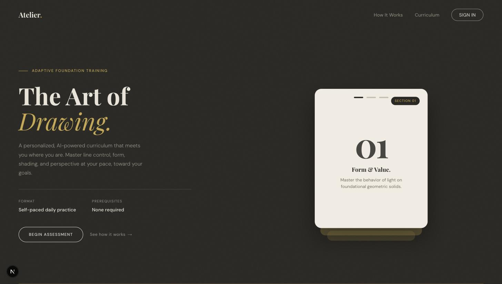
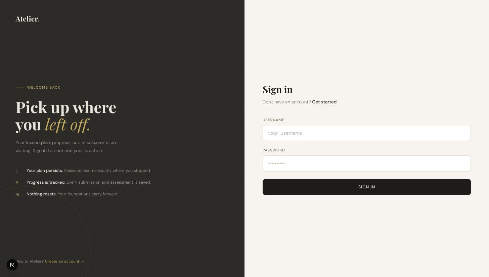
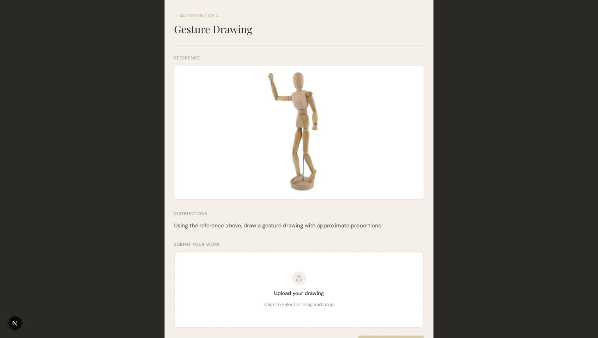

# Atelier

**AI-powered, adaptive art learning platform**


Atelier grades your drawings, builds you a personalized art curriculum, and coaches you through it — all with an AI agent that remembers your progress.

---

## Demo

| Landing page | Sign in |
|---|---|
|  |  |

| Pretest assessment |
|---|
|  |

<!-- TODO: the dashboard and chat tutor require a logged-in session with a running backend + seeded curriculum data,
     so they aren't captured here yet. Add screenshots of those once there's a demo account to log in with. -->

## Overview

Atelier is a capstone project that pairs a Next.js frontend with a Django REST backend and an Ollama-backed AI agent to deliver adaptive, one-on-one art instruction. New users take a **pretest**, submitting drawings (gesture, life drawing, still life, thumbnail sketches) that a vision-capable AI grading agent scores against skill criteria. Based on that score, plus the user's stated goals and available time, the backend generates a **personalized curriculum** of lessons. As users complete lessons and submit work, an AI agent grades each submission and an AI **chat tutor** — backed by per-user long-term memory — is available for questions and can adjust the plan (e.g. changing time commitment) on request.

## Features

- **AI-graded pretest** — submit drawings across multiple categories and get an AI-generated skill assessment
- **Personalized curriculum generation** — a dashboard of lessons/sections tailored to skill level, goals, and time commitment
- **Per-lesson AI feedback** — submit artwork for each lesson and receive AI grading/feedback that adapts future lessons
- **AI chat tutor** — a stateful agent with per-user long-term memory (ChromaDB) that can answer questions and take actions like adjusting your schedule
- **Auth** — register/login via username or email

## Tech stack

| Layer | Technologies |
|---|---|
| **Frontend** | Next.js 16 (App Router), React 19, TypeScript 5, Tailwind CSS 4, Vercel Analytics |
| **Backend** | Django 6, django-ninja (REST API), django-cors-headers, Celery + Redis (async task queue), gunicorn, whitenoise |
| **Database** | SQLite (local dev), PostgreSQL (production, via `DATABASE_URL`) |
| **AI / Agent** | Ollama Cloud (`kimi-k2.6:cloud`), pydantic-ai, ChromaDB (vector memory), sentence-transformers |

## Project structure

```
Atelier/
├── frontend/       Next.js web app (UI, onboarding, dashboard, chat)
├── backend/        Django REST API + Celery tasks (grading, curriculum generation, chat)
│   └── curriculum/ Core Django app: models, API routes, AI agent, Celery tasks
├── ai/             Standalone demo/sandbox for the grading agent (see ai/README.md)
└── demo-assets/    Sample images for demoing the grading feature
```

## Getting started

### Prerequisites

- Node.js (for the frontend)
- Python 3.13
- Redis (for Celery — required for grading, curriculum generation, and chat, since these run as async tasks)
- An [Ollama Cloud](https://ollama.com) API key

### 1. Backend

```bash
cd backend
python -m venv venv
source venv/bin/activate  # Windows: venv\Scripts\activate
pip install -r requirements.txt

# create a .env file in backend/ with at least:
#   SECRET_KEY=your-django-secret-key
#   OLLAMA_API_KEY=your-ollama-cloud-key
# (see Environment variables below for the full list)

python manage.py migrate
python manage.py runserver
```

### 2. Celery worker (separate terminal, same venv)

Grading, curriculum generation, and chat all run as background tasks, so a worker must be running against Redis:

```bash
cd backend
celery -A art_project worker --loglevel=info
```

### 3. Frontend (separate terminal)

```bash
cd frontend
npm install
npm run dev
```

The app will be available at `http://localhost:3000`, talking to the Django API (default `http://localhost:8000`).

### Optional: standalone AI grading demo

The `ai/` folder is a smaller, standalone sandbox that demonstrates just the grading agent (image + assignment in, grade out), independent of the Django app:

```bash
cd ai
pip install -r requirements.txt
python main.py
```

## Environment variables

No `.env.example` is committed yet — the variables below are read from `backend/art_project/settings.py`. Set them in a `.env` file in `backend/` (or `ai/` for the standalone demo).

| Variable | Required | Default | Description |
|---|---|---|---|
| `SECRET_KEY` | Yes | — | Django secret key |
| `OLLAMA_API_KEY` | Yes | — | Bearer token for the Ollama Cloud API, used by all AI agent calls |
| `DEBUG` | No | `False` | Django debug mode |
| `ENVIRONMENT` | No | `production` | Set to a non-`production` value for local dev to skip requiring `DATABASE_URL` |
| `DATABASE_URL` | Only in production | — | Postgres connection string; local dev falls back to SQLite |
| `REDIS_URL` | No | `redis://localhost:6379/0` | Celery broker/result backend |
| `PORT` | No | — | Set by the hosting platform (e.g. Railway) |

## Testing & linting

- **Frontend**: ESLint is configured (`npm run lint`). No test framework (Jest/Vitest/Playwright) is set up yet.
- **Backend**: no test suite exists yet — `curriculum/tests.py` is still the default Django stub. No backend linter (flake8/black/ruff) is configured.

## Deployment

- **Frontend** is deployed on [Vercel](https://vercel.com).
- **Backend** is deployed on [Railway](https://railway.app) (see `backend/Procfile`, `backend/runtime.txt`).
- Production domain: `atelierart.dev`.

### Known limitations

- `backend/Procfile` currently defines two `web:` process lines (one for `gunicorn`, one for `manage.py migrate`); most Procfile parsers only honor the first, so migrations may not be running automatically as intended on deploy — worth double-checking.
- No CI/CD pipeline (`.github/workflows`) is configured yet.
- No `.env.example` is committed — new contributors have to reconstruct required variables from `settings.py` (or this README).

## Team

Built by a three-person capstone team:

| Name | Focus |
|---|---|
| **Alex Torres** ([@atorres502](https://github.com/atorres502)) | Backend, with AI assistance |
| **Mark Runkle** ([@mrunkle01](https://github.com/mrunkle01)) | Frontend, with assistance across backend and AI |
| **Seth Cherry** ([@21stRegi](https://github.com/21stRegi)) | AI (primary) |

## License

No license has been specified yet.
